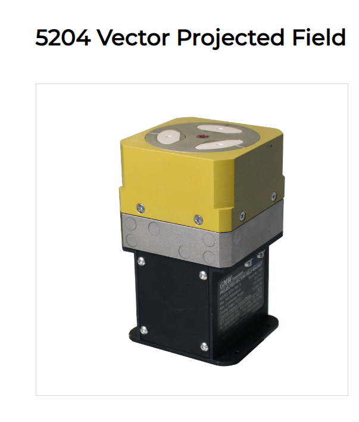
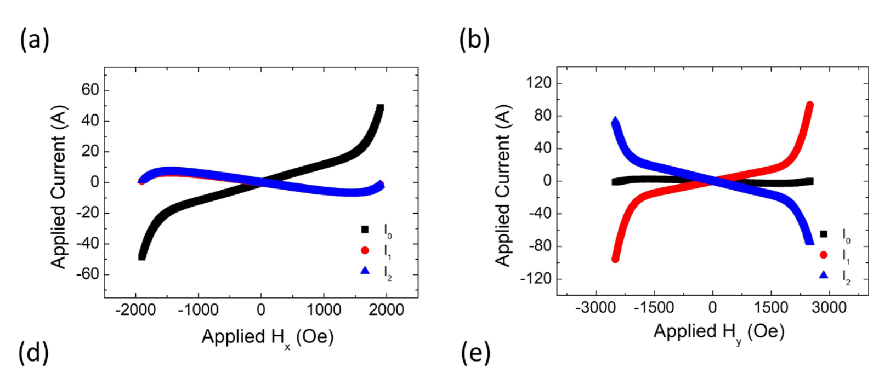

Here I assembled essential information on calibrating the electromagnet (EM) for the TIRF experiment. When I say calibration, I refer to the relationship between the applied voltages and the resulting magnetic field vector. In particular, we need to know what voltage values we need to apply in order to create a desired magnetic field. For more information, especially numerical simulations, please see my dedicated [GitHub repository](https://github.com/tretyakovmipt/TIRF_magnet_calibration/settings).

In the experiment, we use [GMW 5204 Vector Projected Field electromagnet](https://gmw.com/product/5204/).

The company does not provide much information on EM principle, but there is some information in [this recent paper](https://journals.aps.org/prresearch/abstract/10.1103/PhysRevResearch.4.033040).

According to this paper, if I understand correctly, EM has three poles, each provided by a coil wrapped around a ferromagnetic core. The poles are located in the same plain at the same distance from the axis of symmetry, and their position vectors are at $120^0$ with respect to each other. By applying a voltage to each pole, we can control the magnetic field magnitude and direction.

The magnetic field is linear between -1000 and 1000 Oe, or -100 and 100 mT, and shows non-linearities at higher fields.

The EM manufacturer did not provide any information on how to calibrate the magnet, so we needed to figure it out ourselves. In the paper, they employed a simple artificial neural network as the calibration. For our experiment, we don’t need strong magnetic fields, so we might get with the linear regime. In this case, the calibration is rather simple, and I describe it below.

## Warning!

Before we start, I want to stress that **the calibration is done for a specific point in space** at a specific distance and orientation with respect to the magnet. If we want to know the magnetic field at a different point, we’ll need to recalibrate.

## Linear case

First, I’d like to provide some theoretical considerations that might help with the intuition of what is going on. At least, this is how **I** understand it.

In the linear case, each pole can be treated as a magnetic dipole, which creates the magnetic field according to

$$
\mathbf{B} = \dfrac{\mu_0}{4\pi}\left(\dfrac{3\mathbf{r}(\mathbf{m}\cdot\mathbf{r})}{r^5}-\dfrac{\mathbf{m}}{r^3} \right)
$$

where **r** is the coordinate vector where the magnetic is calculated given with respect to the dipole position, $\mu_0$ is a constant, and **m** is the magnetic dipole moment, which we assume is linearly proportional to the applied voltage. It might not be obvious at first, but the above relation is linear with respect to **m,** meaning that it is linear with respect to the voltage.

EM can be treated as three dipoles located in the same plain at the same distance from the axis of symmetry, and their position vectors are at $120^0$ with respect to each other and oriented along the same axis. Since the total field is the sum of the fields produced by the three dipoles and an ambient field $B_0$, it is a linear combination of the three voltages. In a matrix form, it can be expressed like this:

$$
\mathbf{B} =\mathbf{B}_0 + \begin{bmatrix} 	\dfrac{\partial B_x}{\partial V_1} & \dfrac{\partial B_x}{\partial V_2} & \dfrac{\partial B_x}{\partial V_3} \\ \\
\dfrac{\partial B_y}{\partial V_1} & \dfrac{\partial B_y}{\partial V_2} & \dfrac{\partial B_y}{\partial V_3}\\ \\
	\dfrac{\partial B_z}{\partial V_1} & \dfrac{\partial B_z}{\partial V_2} & \dfrac{\partial B_z}{\partial V_3}\\
	\end{bmatrix}\begin{bmatrix}V_1\\ V_2\\ V_3 \end{bmatrix} = \mathbf{B}_0 + \hat{M}\mathbf{V},
$$

where each partial derivative in the matrix is just a fancy way to express the proportionality coefficient between the corresponding field component and the voltage and is the same as the slope of the B-vs-V plot. As a result, in order to produce field B, we need to apply the set of voltage values given by

$$
\mathbf{V} = \hat{M}^{-1}\cdot(\mathbf{B}-\mathbf{B}_0).
$$

We call $\hat{M}^{-1}$ a calibration matrix. In order to find the calibration matrix, we need to measure each field component vs. each voltage (while others are constant, e.g., zero) and find the slopes, which does not require that much data.

## Non-linear case.

In the non-linear case, the above approach does not work, so the simplest solution is to use deep learning. We’ll need much data for training and validation including the data where all voltages are applied simultaneously.
